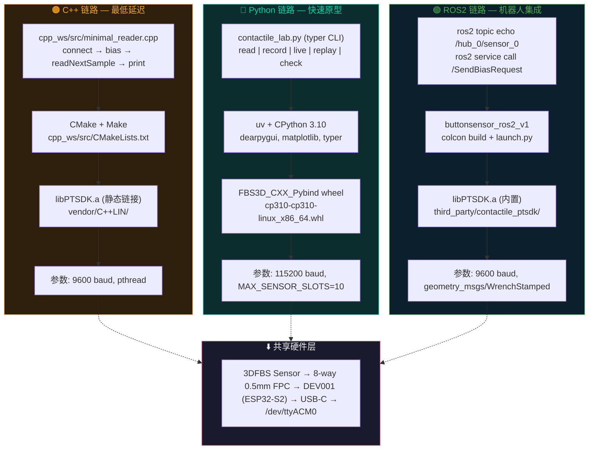

# 三条链路分层架构

C++ / Python / ROS2 三条链路共用同一套 vendor SDK 和硬件，属于并列的三种消费方式。

## 链路对比

| | C++ | Python | ROS2 |
|------|-----|--------|------|
| 入口 | `cpp_ws/src/minimal_reader.cpp` | `python_ws/contactile_lab.py` | `ros2 topic echo` |
| 构建 | CMake + Make | uv run | colcon build |
| SDK | `libPTSDK.a` 静态链接 | `cp310` wheel, pybind | `libPTSDK.a` 内置 |
| Python 版本 | — | 3.10 (wheel 约束) | 系统 3.12 |
| 波特率 | 9600 | 115200 | 9600 |
| 依赖 | pthread | dearpygui, matplotlib, typer | rclcpp, geometry_msgs |

## 适用场景

| 场景 | 推荐链路 | 理由 |
|------|---------|------|
| 最低延迟采集 | C++ | 无 GC, 无 GIL, 直接系统调用 |
| 快速原型 + 可视化 | Python | typer CLI, DearPyGui 实时曲线, matplotlib 回放 |
| 机器人系统集成 | ROS2 | 标准 topic/service, RViz 可视化 |
| 数据归档 | Python record | CSV 输出 + 软件基准扣除 |
| 嵌入式部署 | C++ | 静态链接, 无运行时依赖 |
