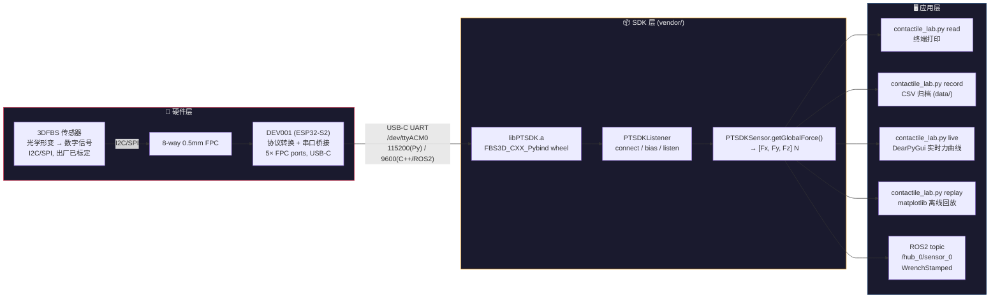

# 数据流图

从传感器物理形变到终端可视化/CSV/ROS2 topic 的完整数据链路。



## 关键数据变换

| 阶段 | 数据形式 | 说明 |
|------|---------|------|
| 传感器 | 光学信号 → 数字量 | 硅胶柱形变, 出厂标定矩阵 |
| FPC 总线 | I2C (0x57) / SPI (Mode 0) | DEV001 自动协议适配 |
| USB 串口 | UART 字节流 | CDC ACM, 最高 12Mbit/s |
| libPTSDK | `float[3]` → `[Fx, Fy, Fz]` (N) | C++ struct, pybind 转 Python tuple |
| 应用层 | `(timestamp_us, fx, fy, fz)` | 软件基准扣除 + 降采样 |

## 时间戳链路

```
传感器硬件 ts (us) → PTSDKSensor.getTimestamp_us() → Sample.timestamp_us
主机单调钟 (ns) → time.monotonic_ns()            → Sample.t_monotonic_ns
```
